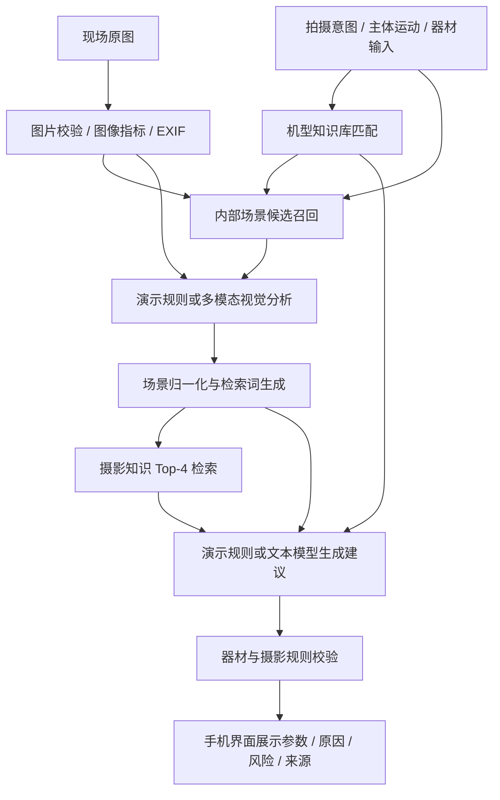

# 小栗取景参谋 📷


**面向摄影新手的相机调参助手：上传现场图，描述想要的效果，获得结合场景、摄影知识和具体机型的拍摄建议。**

这个学生项目围绕一个常见问题展开：新手知道想拍什么，却不知道怎样设置光圈、快门、ISO 和对焦。小栗尝试把“现场环境 + 拍摄意图 + 器材能力”转换成可执行、可解释、可以继续调整的拍摄方案。

当前版本为 `0.1.0`，采用 Python + Streamlit，提供手机应用式的单列 Web 界面。默认使用无需密钥的演示模式，同时已经实现可配置的多模态模型调用接口。

[快速开始](#快速开始) · [当前完成情况](#当前完成情况) · [RAG检索与队友协作](docs/rag-roadmap.md) · [开发路线](#开发路线) · [创新与拓展](#创新与拓展) · [详细架构](docs/architecture.md)

<br clear="right">

## 使用流程

1. 上传现场 JPG / JPEG / PNG 原图，默认最大 15 MB。
2. 描述目标，例如“夜晚拍跑动的小狗，希望主体清晰，背景稍微虚化”。
3. 选择主体运动与手持 / 三脚架状态；在折叠设置中补充机型、画幅、焦段和最大光圈。
4. 查看光圈、快门、ISO、拍摄模式、对焦、测光、白平衡及曝光补偿建议。
5. 展开查看推荐原因、现场风险、参数修正记录、场景依据和知识来源。

具体机型优先于手工选择的画幅。未知型号会按画幅使用通用配置；焦段和最大光圈填写得越完整，器材约束越有依据。

## 当前完成情况

| 模块 | 已实现 | 当前边界 |
| --- | --- | --- |
| 手机应用式界面 | 小熊猫助手、单列布局、折叠器材设置、底部区段导航 | 当前是 Web App，未打包为 Android / iOS 应用 |
| 图片分析 | 文件校验、EXIF 字段提取、方向矫正、亮度 / 对比度 / 高光 / 阴影 / 清晰度指标 | 部分文件可能没有 EXIF；当前未覆盖所有厂商的嵌套 EXIF |
| 场景知识库 | 标准场景定义、规则候选召回、场景名称归一化和识别依据 | 知识库约束分类，不替代真正的视觉识别 |
| 多模态接口 | 兼容 Chat Completions 的图文请求、结构化 JSON 解析、数据模型校验 | 真实识别效果依赖所配置模型，尚未完成系统评测 |
| 摄影知识检索 | Markdown 知识库、中文字符 / 双字组合与词频评分、Top-4 检索 | 当前是关键词检索基线，未接入 Embedding 或向量数据库 |
| 受管多知识库 | 六库注册、SQLite版本与审计、严格导入、互审发布、许可与评测隔离、分库条件检索、CLI | 默认不导入正式内容；需显式开启managed模式；无管理页面、身份认证或图文向量检索 |
| 机型匹配 | 画幅系数、标准 ISO、保守自动 ISO 上限、快门能力、防抖说明、品牌菜单术语 | 默认型号由用户选择；未实现 EXIF 自动选型和完整镜头库 |
| 参数生成与校验 | 演示规则推荐 / 云端模型推荐，最大光圈、运动快门、ISO、电子快门及慢门风险校验 | 字符串规则校验尚不能覆盖所有参数表达和拍摄限制 |
| 测试 | 页面启动、完整流程、知识检索、场景匹配、机型解析及参数校验 | 自动化测试不等同于实拍效果或识别准确率评测 |

### 两种运行模式

- **演示模式**：场景主要由用户意图、图片统计与内部规则推断；推荐由本地规则生成。适合离线演示、界面调试与回归测试。当前规则推荐器接收检索结果，但没有逐条使用资料内容推导参数。
- **云端模式**：视觉模型分析经过缩放的图像副本，文本模型结合结构化场景、机型数据和检索资料生成建议，再进行规则校验。需要配置有效的图像模型与文本模型。

当前置信度来自启发式规则或模型返回值，尚未经过统计校准，不能当作已经验证的准确率。现场照片的亮度也不等同于现场绝对照度，建议参数应结合相机测光和实拍结果微调。

### 首批机型与知识范围

具体机型：Canon EOS R50、Nikon Z50、Sony α6700、Fujifilm X-S20。

通用配置：全画幅、APS-C、M4/3、未知机型。机型资料的厂商链接保存在 [camera_profiles.yaml](knowledge/cameras/camera_profiles.yaml)；保守自动 ISO 上限是本项目策略，不是厂商宣称的画质阈值。

摄影知识覆盖曝光基础、人像、快速主体、风景、瀑布慢门、手持 / 三脚架夜景、食物、逆光和常见问题。场景分类与摄影文档分开维护。

### 知识库搭建与内容整理分离

新增工程底座注册 `scene`、`composition`、`style`、`technique`、`equipment`、`case` 六个空库。不自动采集资料或将已有文档判定为审核通过。默认保留旧演示模式；设定 `KNOWLEDGE_RETRIEVAL_MODE=managed` 后，只检索已发布且允许检索、条件匹配的参考资料，不混入旧目录或评测答案。

```bash
python -m camera_assistant.knowledge init
python -m camera_assistant.knowledge libraries
python -m camera_assistant.knowledge --help
```

数据库默认在 `data/knowledge.db`，不提交Git。知识库开发者的配置、实际导入格式、CLI和队友接口见 [知识库工程说明](docs/knowledge-development.md)；整理人员的范围、任务与审核清单见 [整理规范](docs/knowledge-handbook.md)。原场景与机型YAML仍由原服务使用，不会自动被新库覆盖。

## 快速开始

需要 Python 3.11 或更高版本。在项目根目录运行以下命令。

### Windows / PowerShell

```powershell
py -m venv .venv
.\.venv\Scripts\python.exe -m pip install -e ".[dev]"
Copy-Item .env.example .env
.\.venv\Scripts\python.exe -m streamlit run app.py
```

如果已有 `.env`，保留已有配置，跳过复制步骤。以上命令直接调用虚拟环境内的 Python，不需要修改 PowerShell 执行策略。

### macOS / Linux

```bash
python3 -m venv .venv
.venv/bin/python -m pip install -e '.[dev]'
cp .env.example .env
.venv/bin/python -m streamlit run app.py
```

启动后访问 `http://localhost:8501/`。默认 `APP_DEMO_MODE=true`，不需要模型密钥即可运行完整演示。

手机与电脑连接同一个局域网时，可在手机浏览器输入 `http://<电脑局域网IP>:8501/`。需保证服务允许局域网访问且系统防火墙允许该连接；手机上的 `localhost` 指手机自身。当前手机形式是浏览器界面，安装与原生拍照功能仍在规划中。

## 接入多模态服务

编辑本地 `.env`：

```dotenv
APP_DEMO_MODE=false
CAMERA_AI_API_KEY=replace_with_your_local_key
CAMERA_AI_BASE_URL=https://your-provider.example/v1
CAMERA_AI_VISION_MODEL=your-image-model
CAMERA_AI_TEXT_MODEL=your-text-model
CAMERA_AI_TIMEOUT_SECONDS=60
CAMERA_AI_MAX_IMAGE_MB=15
```

接口需兼容 `/chat/completions`，视觉模型需接受 `image_url` 图片消息，两个模型都需返回可解析的 JSON。修改配置后重启 Streamlit 服务，以重新加载缓存的主流程。配置不完整时程序会使用演示模式；云端请求失败时会显示错误，目前没有自动重试或自动切换到离线模式。

云端模式会向所配置服务发送用于分析的图像副本、用户拍摄需求和必要的分析信息。请先确认使用的是自己选定的服务。当前代码没有将用户照片写入项目目录，也没有持久化历史库；最近一次结果仅保存在 Streamlit 会话中。

`.env`、Streamlit 密钥文件、上传目录和本地缓存均应通过 `.gitignore` 排除，仓库仅保留不含密钥的 `.env.example`。如果调整上传上限，应同时更新 `.streamlit/config.toml` 与环境变量。

## 实现架构



详细数据流、模块职责和限制见 [架构文档](docs/architecture.md)。

## 开发路线

以下为分阶段计划。未完成项目和评测目标是规划，不代表已经达到的指标。建议按学生项目可投入的时间推进，先完成效果验证，再扩展客户端。

| 阶段 | 状态 | 主要工作 | 验收结果 |
| --- | --- | --- | --- |
| 1. 基础 MVP | 已完成 | 图片处理、场景与机型知识库、检索基线、推荐校验、手机应用式页面、演示模式 | 无密钥可运行完整链路，现有自动化测试通过 |
| 2. 真实识别与可靠性 | 待开发 / 验证 | 选定服务、20–30 张标注样例、补齐 EXIF 解析、请求重试、低置信度澄清、结构化参数校验 | 记录场景 / 主体 / 光线准确率、失败率与耗时；目标分类平均准确率 ≥80% |
| 3. 知识检索升级 | 工程底座已实现，内容与向量检索待推进 | 六库管理、审核发布、条件过滤已有；后续扩充资料、Embedding与混合检索 | 在固定 30 个问题上对比检索基线；目标 Top-3 命中率 ≥85%，未实测 |
| 4. 实拍反馈与项目评测 | 待开发 | 30–50 个拍摄案例、专家合理性评分、试拍照片与 EXIF 反馈、结果对比 | 目标器材冲突率 <5%；形成案例集、评分记录和实验报告 |
| 5. 手机产品化 | 待开发 | 分离后端 API、移动前端、拍照 / 相册入口、结果历史与收藏、部署 | 完成真机使用链路；根据需求再选择可安装 Web App 或原生封装 |

完整任务清单与阶段依赖见 [开发路线](docs/roadmap.md)。

## 创新与拓展

本项目已经采用“场景定义 + 摄影知识 + 机型能力”的三层知识结构，并展示建议依据。下面是可以进一步做成课程亮点、实验课题或产品功能的方向，均尚未实现。

| 方向 | 如何落地 | 能解决什么 | 优先级 / 难度 |
| --- | --- | --- | --- |
| 试拍反馈闭环 | 用户上传按建议拍摄的照片，结合 EXIF、直方图和清晰度给出第二轮调整 | 从一次泛化建议进步到基于真实结果的纠偏 | 高 / 中 |
| 感知不确定性与主动提问 | 区分模型判断、用户输入与 EXIF 事实；不确定时追问运动、焦段或三脚架 | 避免信息不足时给出过于肯定的参数 | 高 / 低至中 |
| 可解释的器材约束 | 参数改成数值结构，增加镜头范围、快门类型、滚动快门和运动防抖限制 | 给出机身和镜头实际可设置的参数，并说明修正原因 | 高 / 中 |
| 风格目标分解 | 将虚化、凝固动作、低噪点、拖影、色调分别映射为拍摄或后期操作 | 让“想要某种风格”变成可解释的控制目标 | 中 / 中 |
| 拍摄策略对照卡 | 同一场景给出清晰优先、低噪优先、效果优先方案，并解释代价 | 帮新手理解参数取舍，而非机械照抄 | 中 / 低至中 |
| 个人器材与偏好档案 | 保存机身镜头、可接受噪点、拍摄习惯，使用用户反馈更新偏好 | 减少重复输入，形成个性化推荐 | 中 / 中 |
| 来源追踪与知识评测 | 知识条目带来源、版本、适用条件；记录召回与引用证据 | 让推荐能复查，便于做有对照组的 RAG 实验 | 中 / 中 |
| 天气与时段辅助 | 在用户授权后使用粗粒度城市 / 时间，辅助解释阴天、日落和天气变化 | 补充拍摄准备信息；天气只能作辅助，不能替代测光 | 低 / 中 |
| 手机相机与离线能力 | 手机拍照入口、轻量本地图像分析、离线知识卡 | 方便现场使用，减少对网络的依赖 | 低 / 高 |

建议学生版先完成 **真实多模态评测 + 器材约束校验 + 试拍反馈闭环**。这三项能围绕同一个问题形成“识别—推荐—实拍—调整”的可展示流程，并有明确的对照实验。

更详细的实施拆解和评测设计见 [项目规划与创新点](docs/planning.md)。

## 项目结构

```text
.
├── app.py                         # 手机应用式 Streamlit 界面
├── assets/
│   ├── camera-red-panda.png        # 小栗卡通素材
│   ├── mascot-candidates/         # 角色视觉探索素材
│   └── style.css                  # 移动端视觉样式
├── docs/
│   ├── architecture.md            # 架构与实现边界
│   ├── roadmap.md                 # 分阶段任务与验收
│   ├── planning.md                # 产品规划、创新点与评测
│   ├── knowledge-development.md   # 多库工程、CLI与队友接口
│   └── knowledge-handbook.md      # 知识整理规范与人员任务
├── knowledge/
│   ├── cameras/                   # 机型规格、术语与厂商来源
│   ├── recognition/               # 场景定义、候选规则与检索词
│   └── ...                        # 各类摄影 Markdown 知识
├── src/camera_assistant/
│   ├── config.py                  # 配置读取
│   ├── models.py                  # Pydantic 数据结构
│   ├── pipeline.py                # 识别 / 检索 / 推荐编排
│   ├── knowledge/                # 受管多库模型、SQLite、导入、检索与CLI
│   └── services/
│       ├── image_analyzer.py      # 图片与 EXIF 分析
│       ├── scene_knowledge.py     # 场景知识与归一化
│       ├── camera_knowledge.py    # 机型能力匹配
│       ├── vision.py              # 演示 / 云端图像分析
│       ├── retriever.py           # 本地关键词检索
│       ├── advisor.py             # 演示 / 云端建议生成
│       └── validator.py           # 参数约束与风险提示
├── tests/                         # 核心回归测试
├── .streamlit/config.toml          # 主题与上传配置
├── .env.example                   # 无密钥配置模板
└── pyproject.toml                 # 依赖、包信息与工具配置
```

## 本地检查与贡献

安装开发依赖后执行：

```bash
python -m pytest -q
python -m ruff check .
```

可以从三类小任务开始：补充一种场景及适用条件、添加一个带厂商来源的机型、提交一个能复现错误建议的测试案例。新增知识库或机型数据后重启服务，确保缓存加载的是新版本。新增摄影资料时记录来源与使用范围，避免直接复制整篇受版权保护的材料。

小栗及备选动物插画为项目开发过程中生成的 AI 素材。当前未单独声明代码或图片的开源许可证；如后续公开发布，需由维护者明确授权方式。

## 当前限制

- “原图”指手机或相机直接输出的图片；当前仅支持 JPG / JPEG / PNG，不支持 HEIC、各厂商 RAW 或实时视频。
- 不控制真实相机，不包含厂商遥控连接、账号系统、持久化历史或原生 APK。
- 演示模式不具备完整的视觉语义识别能力；云端模式尚未完成服务商效果验证。
- 图像统计指标是简单分析线索，不是经过标定的测光、模糊诊断或摄影评分。
- 单张已曝光照片无法可靠反推出现场绝对照度；机型匹配也不能独自保证曝光正确。
- 当前参数校验是规则基线，尚缺少快门类型、镜头完整规格和极端条件的细化处理。
