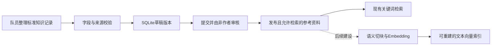
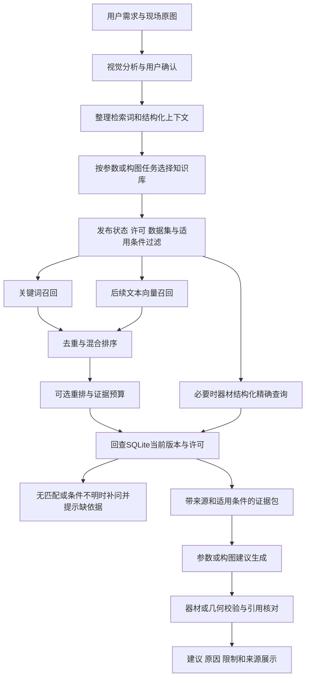

# RAG 检索流程与开发路线（队友协作版）

更新日期：2026-10-10。本文是检索模块的接入说明和后续规划，不代表向量检索、重排或图像案例检索已经实现；本轮不改检索代码、不新增正式知识内容。

## 1. 先读这一页：我们要做什么

RAG（检索增强生成）在本项目中负责：根据用户目标和现场分析，找到适用、经过审核的摄影资料，让建议有依据可查。它不代替视觉识别，也不代替器材能力和几何约束校验。

建议按以下顺序开发，不一次引入所有组件：

**已有受管关键词基线 → 建立评测与分库路由 → 文本向量检索 → 混合召回 → 按需重排 → 图像案例检索。**

- SQLite继续作为知识正文、版本、来源和审核状态的唯一权威来源。
- 向量索引只是可重建的检索副本，不成为第二套独立的审核系统。
- 参数建议优先查技术／器材；构图建议优先查构图／风格／案例。不要把六个库全部拼进一次检索。
- 检索不到就说明缺少依据；不要捏造来源、自动放宽机型条件或偷偷切回旧库。

## 2. 当前代码已经做到哪里

| 环节 | 当前已实现 | 尚未实现／需要注意 |
| --- | --- | --- |
| 知识存储 | 六库共用SQLite，统一记录、版本、审核发布和审计 | 不是向量数据库；正式内容由整理队员提供 |
| 检索模式 | `legacy`旧Markdown库；`managed`受管SQLite库 | 默认仍是`legacy`，需要显式配置切换 |
| 受管检索 | 分库、条件过滤；中文单字／双字组合与词频加权排序 | 不是BM25，也没有Embedding、混合融合或重排 |
| 可检索范围 | 仅`published`、`reference`、允许检索且适用条件匹配的记录 | 草稿、评测资料、未授权资料不能召回 |
| 器材查询 | `query_structured`对payload点路径等值筛选 | 不支持数值区间；不会自动替换现有机型YAML服务 |
| 参数主流程 | 检索`scene`、`technique`、`equipment`，共取Top-4 | 尚无分库配额，器材精确查询尚未接入主链路 |
| 构图接入 | `composition`、`style`、`case`已有独立查询接口 | 未进入主流程；几何分析、规则执行和叠加引导需另开发 |
| 生成与校验 | 云端建议接收检索正文，再做现有规则校验 | 演示建议器没有逐条使用知识正文推导参数；引用逐项校验待开发 |

代码入口：

- [受管检索器](../src/camera_assistant/knowledge/retriever.py)：`ManagedKnowledgeRetriever`。
- [参数主流程](../src/camera_assistant/pipeline.py)：`run`、`_build_query`。
- [结果模型](../src/camera_assistant/models.py)：`KnowledgeHit`。
- [建议生成](../src/camera_assistant/services/advisor.py)、[规则校验](../src/camera_assistant/services/validator.py)。
- 记录格式、导入和审核命令见[知识库工程说明](knowledge-development.md)，整理范围见[知识整理规范](knowledge-handbook.md)。

## 3. 资料准备流程：先管内容，再建索引



当前一文件对应一条知识记录，通常可直接作为一个检索单元。后续遇到长文档时再按章节／规则切块，遵循以下约定：

1. 一块尽量说明一个规则，同时保留适用条件、例外和出处；不将“建议”与“禁用条件”拆开。
2. 器材型号、参数值、单位、模式限制应作为整体保存，不仅靠文本切块检索。
3. 向量化文本可由标题、正文、标签和必要的结构化描述组成；来源和许可主要用于过滤与追溯。
4. 每块绑定`knowledge_id + version + content_hash + chunk_id`，不得混用不同版本的正文与索引。
5. 索引记录Embedding模型标识、维度、文本预处理和切块版本；变更这些配置时重建相应索引。

发布／更新时生成新索引条目；退役或撤销许可时停用旧条目。**查询输出前必须再查SQLite当前状态和内容哈希**，不能只信索引里的历史许可。索引落后时宁可遗漏资料，也不能返回退役知识。

Git提交代码、格式规范与可再分发的测试素材，不提交本地`data/knowledge.db`、用户照片、密钥或生成索引。队友拉取代码后需各自初始化数据库；正式语料如何共享应另外核对再分发许可。

## 4. 在线检索基本流程

下面是目标流程；当前已有图片分析、结构化场景、参数链路关键词检索和建议校验。分任务路由、向量召回、融合／重排及引用校验属于待开发项。



### 第一步：拆分意图与现场事实

例如“想拍夜景人像、背景虚化”，分别保存：用户希望的效果、现场观察、用户确认的运动／机位信息、机型与镜头信息。

不要仅凭亮度统计推断现场照度，也不要把模型猜测直接升级成器材事实。缺少机型或主体运动等关键条件时，先询问或只检索通用资料；模型置信度不是经过校准的准确率。

### 第二步：构造查询和条件

- 查询文本：用户目标、场景／主体、光线、希望解决的问题和必要的摄影术语。
- 结构化上下文：使用模块共同约定的键与标准值，不直接将自由文本当枚举值。
- 当前参数链路已经传递`scene`、`subject`、`motion`、`camera_profile_id`、`camera_format`、`handheld`、`tripod`。
- 构图后续可能需要主体位置、边界框、地平线等观察结果，先由视觉／构图队员定义契约，不假定当前模型已有这些字段。

现有条件匹配规则：标量等值；列表表示可接受值；`null`表示未声明限制。资料声明了条件，但请求缺失该字段时，保守排除。现阶段不能把范围或复杂谓词放进`conditions`并当作已经生效。

### 第三步：选择知识库，不统一漫搜

| 子任务 | 主要查询库 | 建议怎样使用结果 |
| --- | --- | --- |
| 场景解释 | `scene` | 辅助说明场景及适用条件，不代替视觉观察 |
| 参数与问题排查 | `technique` + `equipment` | 技术资料解释策略；器材事实做精确适配和约束 |
| 构图调整 | `composition` + `style` | 找构图规则和表达目标，再由几何模块判断能否执行 |
| 参考作品 | `case`，结合`composition`／`style` | 第一阶段只查案例文字；图像相似检索后续再做 |

后续路由器可按子任务分别召回并设置配额，避免一个热门库挤占全部结果。硬性器材限制由结构化查询／校验模块处理，不让向量相似度或生成模型“投票”决定。

### 第四步：召回、融合、可选重排

先保存关键词基线。新增向量通道后，初始实验可以各取20个候选，按记录／切块标识去重，再融合；最终证据包先从4条左右试起。**这些是实验起点，不是当前实现或固定最优值**，需在开发题集上调试后冻结。

混合检索可尝试按两个通道的名次融合，避免直接相加量纲不同的分数。RRF是一种按排名融合结果的方法；此处只借鉴算法，不要求使用Azure服务。[RRF官方说明](https://learn.microsoft.com/en-us/azure/search/hybrid-search-ranking)

重排不是必选项。只有“候选已召回，但前几条经常排错”且延迟允许时才引入；它不能补救未召回的资料。任何通道和重排结果都要经过相同的许可、版本和条件检查。

### 第五步：组装证据，生成可执行建议

建议证据包保留正文、适用条件、知识编号／版本、来源位置和许可信息，并限制总输入长度。同一知识多个切块不要占满上下文；冲突资料不能拼成一个确定结论，应展示适用差异或提示核实。

模型只负责结合证据解释／提出方案，不执行资料内的指令、脚本或URL。后续输出应把每条重要建议对应到本次证据的ID，再核对引用确实存在、版本一致；没有依据的通用提示须明确标记，不伪造引用。

最后执行器材能力、镜头限制或构图几何约束校验。页面展示“建议、为什么、适用条件、来源、限制”，相关度只用于排序，不能显示成准确率。

## 5. 队友现在就可以使用的接口

以下调用是现有API，不包含向量检索或新路由器；空库／没有适用的已发布资料时返回空列表。示例条件值需要与实际整理资料一致。

```python
from camera_assistant.knowledge.retriever import ManagedKnowledgeRetriever
from camera_assistant.knowledge.store import KnowledgeStore

retriever = ManagedKnowledgeRetriever(KnowledgeStore("data/knowledge.db"))
context = {"scene": "outdoor_portrait", "motion": "static"}

composition_hits = retriever.search(
    "人像 主体位置 留白 背景简洁",
    top_k=4,
    libraries=["composition", "style"],
    conditions=context,
)

# 仅当整理队员约定payload中有camera_model这个字段时才按它筛选。
# 精确字符串必须与实际标准值一致；本调用尚未接入参数主链路。
equipment_records = retriever.query_structured(
    "equipment",
    filters={"camera_model": "Canon EOS R50"},
    conditions=context,
)
```

`search`返回`list[KnowledgeHit]`，含`document_id`、`title`、`content`、`source`、`score`、`metadata`。受管结果的metadata已经包含知识ID、库ID、版本、审核状态、出处、审核人、内容哈希和`retrieval_backend`。`query_structured`返回版本记录，不是同一种结果；接入者需要显式整理，不能当作`KnowledgeHit`直接使用。

未来向量／混合检索应尽量维持这个对外结果契约；新字段需由团队共同约定。其他模块调用检索API，不直接查询数据库表，不自行读取未发布正文。

## 6. 分阶段交付与三人协作

下表是建议职责，可按人员能力调整；不绑定具体姓名。你负责检索工程，另外两位分别承接视觉／构图与资料／评测；审核由非作者交叉完成。

| 阶段 | 你：知识库／检索工程 | 视觉／构图队员 | 资料／评测队员 | 完成条件 |
| --- | --- | --- | --- | --- |
| P0：对齐契约 | 保持现有检索API，明确条件键与空结果处理 | 提供场景字段和构图模块输入需求 | 按现有schema整理，标注条件／来源／权限 | 三人能用同一组字段联调，不绕过审核 |
| P1：做基线 | 增加分任务路由、检索日志与评测脚本 | 接入构图／风格文字结果，先做可解释建议 | 准备30–50条小规模参考资料和30个固定检索问题 | 发布资料能命中；错误条件与未授权资料不召回 |
| P2：语义与混合检索 | 增加文本Embedding、索引构建／停用、融合排序 | 对比构图建议是否更适用，不仅看检索分数 | 标注同义表达、跨库和无答案问题，复核错误案例 | 对比基线／向量／混合，说明改善与退化；更新／退役不串版本 |
| P3：引用与可选重排 | 引用核对、证据预算；有需要才接重排 | 几何校验、用户引导和试拍反馈 | 复核引用及建议适用性，独立评分 | 建议引用可追踪，无依据时不编造，延迟与成本可接受 |
| P4：可选图像案例 | 管理图片资源授权与图文索引，不只扩展文本索引 | 建立图片标注、构图特征和交互闭环 | 核对图片展示／再分发许可，补充案例题集 | 在真实案例上证明有增益后再作为参赛创新点 |

建议未来新增模块如下，**仅为拟议路径，目前未创建**：

```text
src/camera_assistant/knowledge/
  router.py          # 参数／构图等子任务路由与查询构造
  chunker.py         # 长记录切块与来源映射
  embeddings.py     # 文本Embedding适配，模型配置独立
  vector_index.py   # 索引快照、更新、停用和当前版本回查
  hybrid.py         # 去重、融合排序与证据预算
scripts/
  build_knowledge_index.py
  evaluate_retrieval.py
```

先实现P0／P1，不需要立即引入重型Agent框架、知识图谱或独立检索服务器。本路线是基于当前学生项目复杂度的设计选择，不是这些工具的通用性能结论。

## 7. 如何验证“检索更准确”

先评检索，再评建议，最后用实拍验证；不要把页面正常运行、相关度高或JSON完整当成准确性证据。

每个检索问题建议标注：用户问题、结构化上下文、目标库、人工相关知识ID、应排除知识ID、是否无答案、场景类别。题集覆盖同义改写、机型不匹配、运动／三脚架矛盾、缺条件、无答案和退役版本。

| 指标 | 定义／记录方式 |
| --- | --- |
| Hit@3 | 有答案问题中，前三条至少命中一条人工相关资料的比例；单独报告问题数量 |
| Recall@K | 每题召回的人工相关资料数量／该题全部人工相关资料数量，再作宏平均 |
| 不适用资料召回 | 返回结果中条件不符或机型错误的数量与案例 |
| 边界泄漏 | 草稿、未授权、评测答案、退役版本被召回的次数；必须为0 |
| 无答案表现 | 无答案问题的误召回／编造引用比例；与有答案问题分开统计 |
| 引用与建议 | 引用ID／版本是否存在，资料是否支持该项建议，器材／几何约束是否冲突 |
| 代价 | 检索与全链路的延迟分别记录，附硬件、模型版本和调用成本 |

沿用[总体路线](roadmap.md)的首轮Hit@3 ≥85%作为候选验收目标，**不是已达成绩**。三十题只适合小规模初评，报告分场景结果、样本数与错误案例，不作泛化保证。

调词、切块、融合权重和阈值使用开发题集；最终测试题集冻结后不再调参。评测答案保存在独立评测数据中，不能进入可检索索引；`dataset_split=evaluation`记录不能发布。

## 8. 技术选型边界与参考

现阶段保留SQLite和现有关键词检索，不更换存储。做P2时只选择一种文本Embedding方案，先检查中文摄影术语效果、许可证、运行资源、维度与隐私；云端Embedding会传出相应知识文本，需要先确认许可。

关键词通道升级可评估SQLite FTS5／BM25，但须检查当前Python所带SQLite是否支持FTS5，并设计／测试中文分词；不要直接声称默认分词适合摄影中文。[SQLite FTS5官方文档](https://sqlite.org/fts5.html)

小规模本地文本向量索引可评估FAISS，它是向量相似搜索库，不替代本项目的知识存储与审核；安装方式和Windows环境兼容性在真正接入时再验证。是否采用它由P2实验决定，本轮未添加依赖。[FAISS官方项目](https://github.com/facebookresearch/faiss)

RRF参考只用于融合不同通道的排名，不要求采购云服务；图像向量、重排模型、持久化服务和多用户权限都留到有明确需求后再选型。

## 9. 联调前检查清单

- [ ] 记录格式、六库ID、payload字段和条件值已统一；审核与授权完成。
- [ ] 本地初始化数据库，明确自己用的是`legacy`还是`managed`，不要混淆两套资料。
- [ ] 参数与构图子任务各自测试；构图队员通过API接入，不直接改表。
- [ ] 找不到资料会提示缺少依据；没有人为设定的默认准确率。
- [ ] 来源与版本能回查；以后增加索引也能及时排除退役记录。
- [ ] 关键词、向量、混合结果用相同题集、过滤规则和生成模型对比。
- [ ] 工程测试与实拍评测分开报告；未实现的路线项不能写成参赛成果。

最先做的三件事：**对齐上下文／条件字段 → 准备首批已审核资料与检索题集 → 跑现有基线，再开发分任务路由。**
